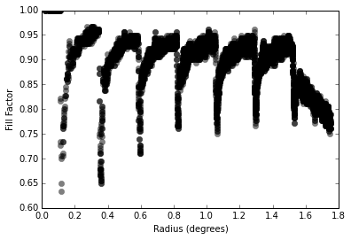

Introduction
============

For deep-drilling fields, one possible observing strategy would be to rely on rotational dithering to fill in chip and raft gaps.  In this technote, we use MAF to explore how well rotational dithering can perform.

Source Code
===========

This analysis was made with MAF and is in an `iPython notebook
<https://github.com/lsst-sims/smtn-004/_static/rotationDithering.ipynb>`_
that can be viewed on GitHub.

Results
=======

We simulate a survey with 180 observations, all pointed at an RA and
Dec of 0,0. The rotation angle of the camera is incremented from 0 to
180 in 2 degree steps. Figure 1 shows the resulting number of
observations made at each point in the field of view.

Observing a single pointing with a large range of camera rotation
angles results in a fill factor of 88.7%, with 90-95% fill at preferred
radii and dropping to 65-75% at radii where chip and raft gaps
converge.  The chip and raft gaps leave circular structures in the
density of observations.  The outermost region of the focal plane also
shows ~80% fill because the corners of the focal plane are populated
by wavefront sensors and not CCDs.

.. figure:: /_static/rot_dither.png
   :name: NumberofVisits

   The results of imaging a single pointing with 180 evenly-spaced rotation angles.
	  

	   

   The fill-factor as a function of radius.  
